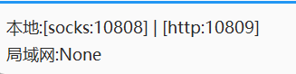
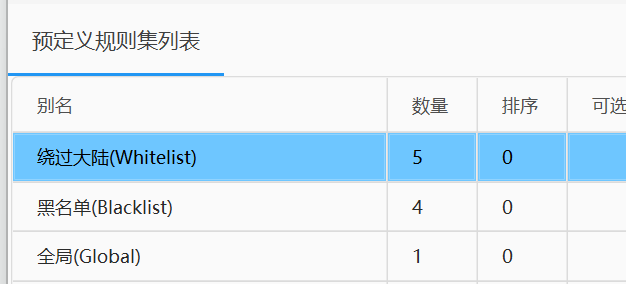
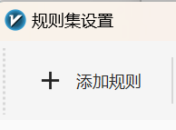

# 设置Git全局代理
即使我们在科学工具中选择的全局代理选项，但由于不论是Windows、Linux还是Mac的终端默认都不走代理端口，所以Git命令还是经常超时。
为了在终端中使用Git，下面介绍两种方法：

## 设置环境变量

### 单次设置环境变量

首先我们需要查看科学工具的代理端口
以V2ray为例，在页面左下角可以看到：



本地IP默认为`127.0.0.1`，则本地HTTP代理端口为`127.0.0.1:10809`,
Clash默认为`127.0.0.1:7890`
```{tab} Windows

在当前终端下输入：

    set HTTP_PROXY=http://127.0.0.1:10809
    set HTTPS_PROXY=http://127.0.0.1:10809
```

```{tab} Mac & Linux

在当前终端下输入：

    export https_proxy=http://127.0.0.1:7890
    export http_proxy=http://127.0.0.1:7890
    export all_proxy=socks5://127.0.0.1:7890
```
则可以设置当前终端窗口使用本地代理。

### 永久设置环境变量

```{tab} Windows

搜索并打开 `编辑系统环境变量 - 环境变量`，在`系统变量`下选择`新建`，填入`本地代理端口`
```

```{tab} Mac & Linux

永久设置需要配置.bashrc或者.zshrc等配置文件。
```
你可以使用

```shell
curl www.google.com
```

测试是否代理是否配置成功。

此处使用`curl`而非`ping`是因为`curl`走普通代理（非TUN）下的HTTP协议，`ping`是基于`ip`的，此时使用`ping`命令即使设置代理也会超时

## 设置TUN模式

常见的科学工具都拥有TUN模式，由于TUN是通过创建虚拟网卡的方式来代理所有流量，所以也可以代理终端。


你可以查看相关文档找到设置的具体方式[Clash TUN文档](https://docs.gtk.pw/contents/tun.html#windows "TUN 模式 | Clash for Windows 代理工具使用说明")

使用TUN模式的一个好处是它可以代理网络层（IP），而普通模式下只能代理应用层（HTTP）
例如，Ping命令使用的ICMP协议位于网络层，普通模式下 

```shell
ping www.google.com
``` 

会超时，而TUN模式则正常。

### 使用技巧
在使用科学工具时，对于一些网站，我们不希望使用国外代理访问，例如在使用国外代理访问bilibili时，因为版权问题，大多数番剧都不能播放。此时，我们可以配置科学上网的代理规则。

以V2ray为例，在设置-路由设置下，可以看到一些预定义规则集列表



它们分别是

    绕过大陆(Whitelist)模式：只是白名单内的网站通过 V2Ray 代理上网
    黑名单(Blacklist)模式：除了黑名单内的网站，其余网站都通过 V2Ray 代理上网
    全局(Global)模式：所有网站通过 V2Ray 代理上网

在普通情况下，我们只需要使用这三个预设模式即可

但对于一上面提到的情况，我们可以通过手动添加对应的规则来解决，在路由设置中添加需要规避的网站。

例如在V2ray中双击一个规则，进入规则集设置，点击添加规则,输入需要规避的网址即可



## 3.Git加速器

例如开源软件[dev-sidecar](https://github.com/docmirror/dev-sidecar  
"dev-sidecar")，可一键免费加速


